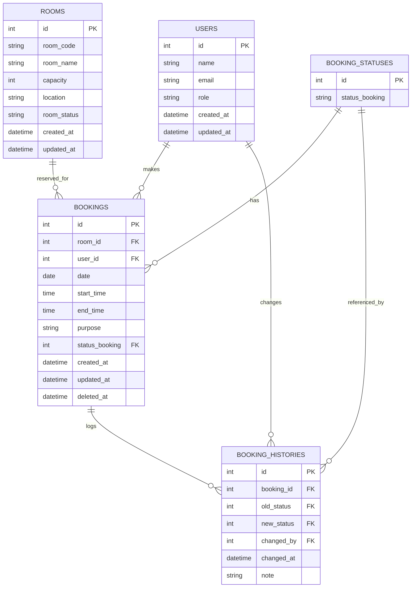
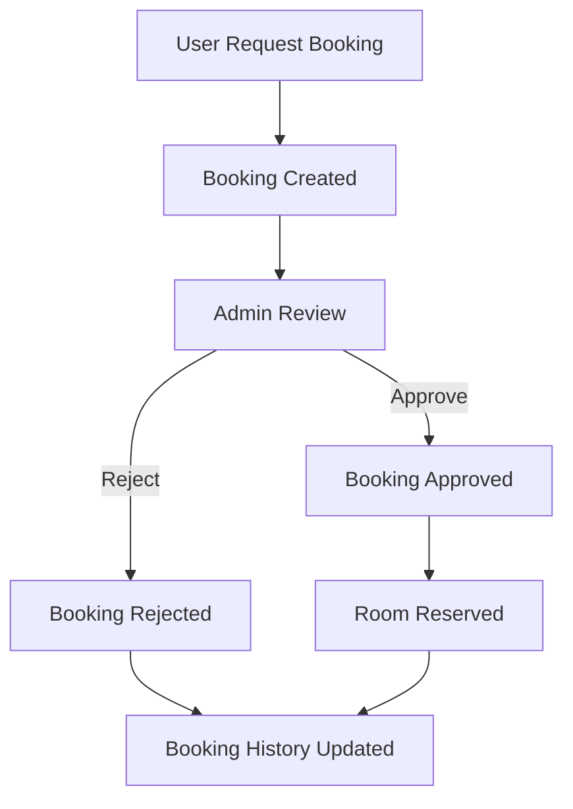

# ERD in Siperuka

## 1. Entity Relationship Diagram (ERD)


## 3. Flowchart Sistem



---

## 4. Use Case Diagram

```mermaid
usecaseDiagram
    actor User
    actor Admin
    User --> (Request Booking)
    User --> (View Booking History)
    Admin --> (Approve/Reject Booking)
    Admin --> (Manage Rooms)
    Admin --> (View All Bookings)
```

---

## 5. Arsitektur Sistem

### Layered Architecture

- **Presentation Layer**: Frontend (React/Vite)
- **API Layer**: Backend Controller (ASP.NET Core)
- **Service Layer**: Business logic (BookingService, RoomService, dsb)
- **Data Access Layer**: Entity Framework, DbContext
- **Database Layer**: SQL Server (atau sesuai konfigurasi)

---

### 1. Users
Tabel ini menyimpan data pengguna sistem, baik sebagai admin maupun peminjam
* `id` : Primary key
* `name` : Nama peminjam
* `email` : Email peminjam
* `role` : Peran pengguna (admin / peminjam)
* `created_at`, `updated_at` : Waktu data dibuat dan terakhir data diperbarui

### 2. Rooms
Tabel ini menyimpan informasi mengenai ruangan yang dapat dipinjam
* `id` : Primary key
* `room_code` : Kode ruangan
* `room_name` : Nama ruangan
* `capacity` : Kapasitas ruangan
* `location` : Lokasi ruangan (gedung/lantai)
* `room_status` : Status ketersediaan ruangan
* `created_at`, `updated_at` : Waktu data dibuat dan terakhir data diperbarui

### 3. Bookings
Tabel ini menyimpan data peminjaman ruangan oleh pengguna
* `id` : Primary key
* `room_id` : Relasi ke tabel `Rooms`
* `user_id` : Relasi ke tabel `Users`
* `date` : Tanggal peminjaman
* `start_time`, `end_time` : Waktu mulai dan selesai peminjaman
* `purpose` : Keperluan peminjaman ruangan
* `status_booking` : Relasi ke tabel `Booking_Statuses`
* `created_at`, `updated_at` : Waktu data dibuat dan terakhir data diperbarui
* `deleted_at` : Waktu penghapusan data (soft delete, opsional)

### 4. Booking_Statuses
Tabel ini menyimpan daftar status peminjaman
* `id` : Primary key
* `status_booking` : Status peminjaman (pending, approved, rejected)

### 5. Booking_Histories
Tabel ini menyimpan riwayat perubahan status peminjaman ruangan
* `id` : Primary key
* `booking_id` : Relasi ke tabel `Bookings`
* `old_status` : Status peminjaman sebelumnya
* `new_status` : Status peminjaman terbaru
* `changed_by` : Pengguna (admin atau peminjam) yang mengubah status
* `changed_at` : Waktu perubahan status
* `note` : Catatan tambahan terkait perubahan status